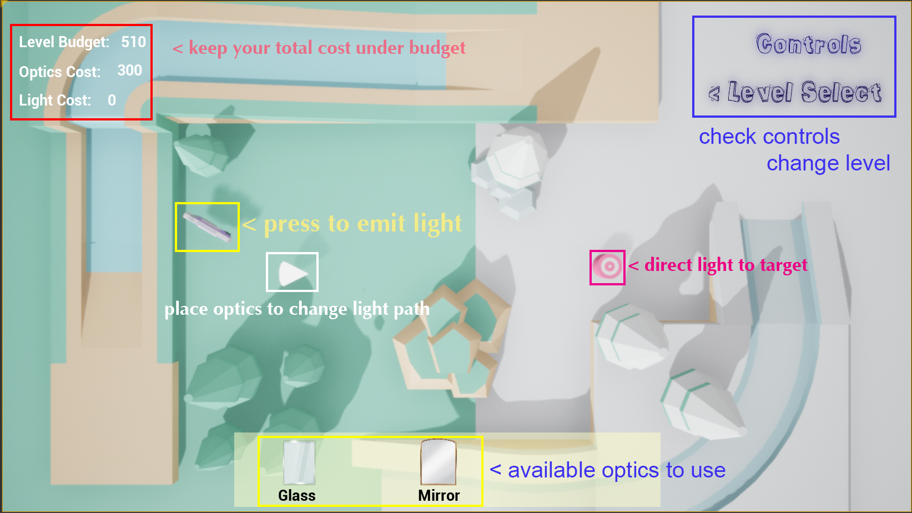
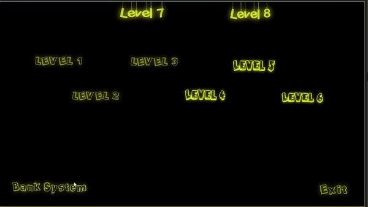
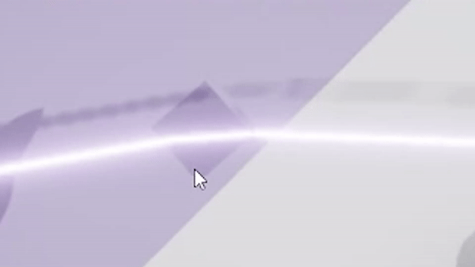

# LightPathFinder
 A physically based puzzle game developed with the Unreal engine.

## User Guide
The goal of this game is to guide the light path from the emitter to the target using optics provided in the optics store. There are two winning conditions that the player must achieve simultaneously to pass a level. The first goal is to make the light hit all the targets. The second goal is to keep all the cost under budget.

The cost in the scene consists of two components, which are the optics cost and the light cost. The optics cost is a sum of all the optics the player placed in the scene, which can be deducted with the upgrade system. The light cost is a function of overall time the player has let the emitter shoot the light ray. The summation of these two costs should be controlled under the level budget. 

The money difference between the total cost and the level budget will be saved into the player’s bank account. The player can later use this balance to unlock other optics and upgrade the optics to make them cost less.

## Controls
**Drag** from the shop bar at the bottom to purchase

**Left** click to change rotation of the optics

**Right** click to change location of the optics

**Click** left and right concurrently to delete the optics

## Game Play Features
**Resources**

The scene has some static obstacles that light can’t pass through. Besides that, there are also some things where the light can interact with.
The target is the main winning guide. When all the targets in one level are triggered by the light ray, the user wins this level.
The gift box is a reward for the user when they guide the light to that position. 
The train is a punishment and the user should avoid the light to hit it.
We get two kinds of portals in our game, one is magic ball shaped, the other is door shaped. For the first one, the light will pass through the portal and keep consistent in the original direction. For the second one, the light will stay the same direction relative to the door.

## Optics
We have three kinds of optics, the glass, the mirror and the secondary emitter.

The light will go through the glass and get a fake refraction effect at the intersection position. The mirror is used to reflect the light. The secondary emitter is used to get an extra ray of light when hitten by the main light. All three optics have a specific cost which users need to control under the budget. They can be placed in the level and manipulated to guide the light to the right position.

## Assets/Software Reference
We used Unreal Engine to develop the game.
Art assets are obtained from https://www.kenney.nl/assets.
